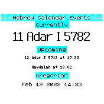

# Hebrew Calendar

Displays the current Hebrew calendar date and upcoming holidays alongside a clock.

## Usage

Set it as your clock in the settings.

The app computes events on-device — no web customizer or internet connection needed.

**Location:** Install the [My Location](https://banglejs.com/apps/?q=mylocation) app and set your coordinates for accurate candle-lighting times. If My Location is not installed, the app defaults to Jerusalem coordinates.

**Settings:** Open Settings → Hebrew Calendar to toggle between Israeli and Diaspora holiday observance (affects second days of holidays and the length of Passover).

## Features

- Shows the Hebrew date, month, and year alongside the Gregorian date
- Shows when upcoming holidays start, including candle-lighting times
- Shabbat candle-lighting and Havdalah times based on your location
- Computes the next 7 days of events at runtime — always up to date, no expiry
- Powered by [hebcal/hebcal-es6](https://github.com/hebcal/hebcal-es6) (MIT license) bundled on-device

## Controls

N/A

## Creator

Michael Salaverry (github.com/barakplasma)
with help from https://github.com/hebcal/hebcal-es6 (MIT license)

Icons made by <a href="https://www.flaticon.com/authors/smashicons" title="Smashicons">Smashicons</a> from <a href="https://www.flaticon.com/" title="Flaticon">www.flaticon.com</a>

